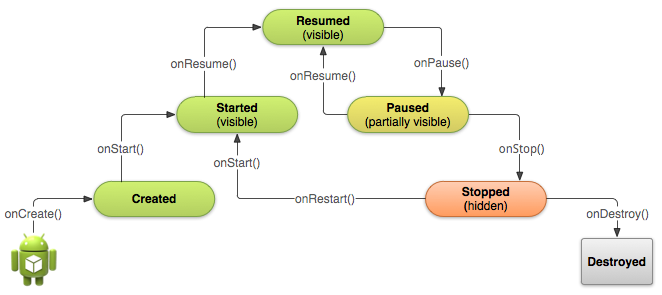

# Introduction
In this course we will learn the basics of Kotlin programming for Android.

## Core Competency
- Android project structures
- Android naming conventions
- Android application lifecycle
- Basic layouts: LinearLayout, ScrollView, and ConstraintLayout
- Basic components: TextView ImageView, and Button
- Variables and function in Kotlin
- Create activity

## Lifecycle

## Contributors
- Arief Purnama Muharram (ariefpurnamamuharram@gmail.com)
