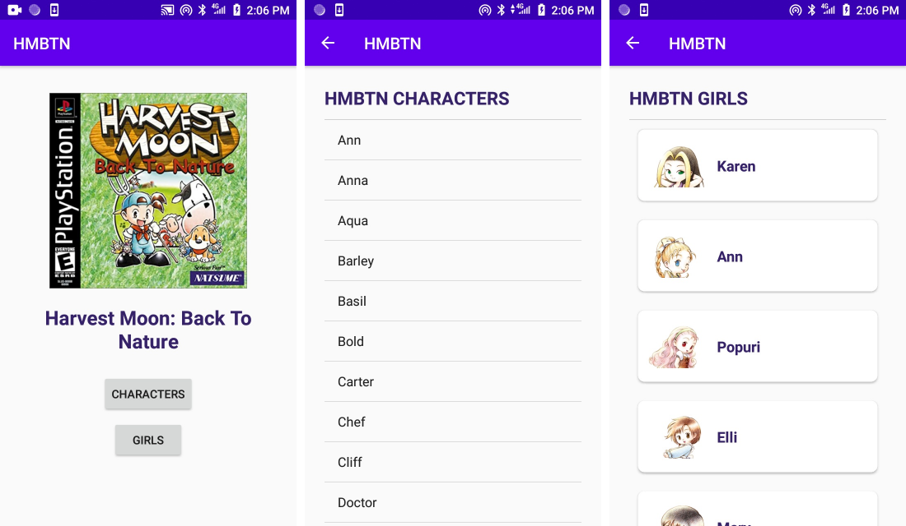

# ListView and RecyclerView
In this section we will learn the basics of ListView and RecyclerView in Android using Kotlin.

## Core Competency
- Adding Graddle dependency
- ListView and RecyclerView
- Data class
- Picasso library

## Application Example

## Contributors
- Arief Purnama Muharram (ariefpurnamamuharram@gmail.com)
