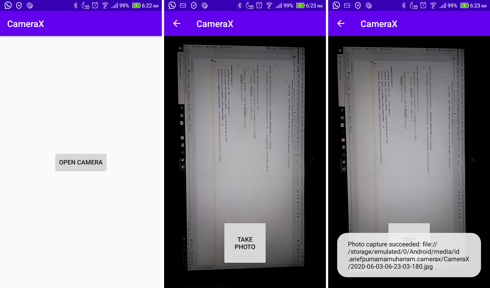

# Jetpack CameraX
In this section we will learn the basics of CameraX library in Android using Kotlin.

## Core Competency
- CameraX dependencies
- Display CameraX in preview
- Take photo and save it to storage

## Application Example

## Contributors
This code is based on Google Codelabs. You can access it directly through https://codelabs.developers.google.com/codelabs/camerax-getting-started/