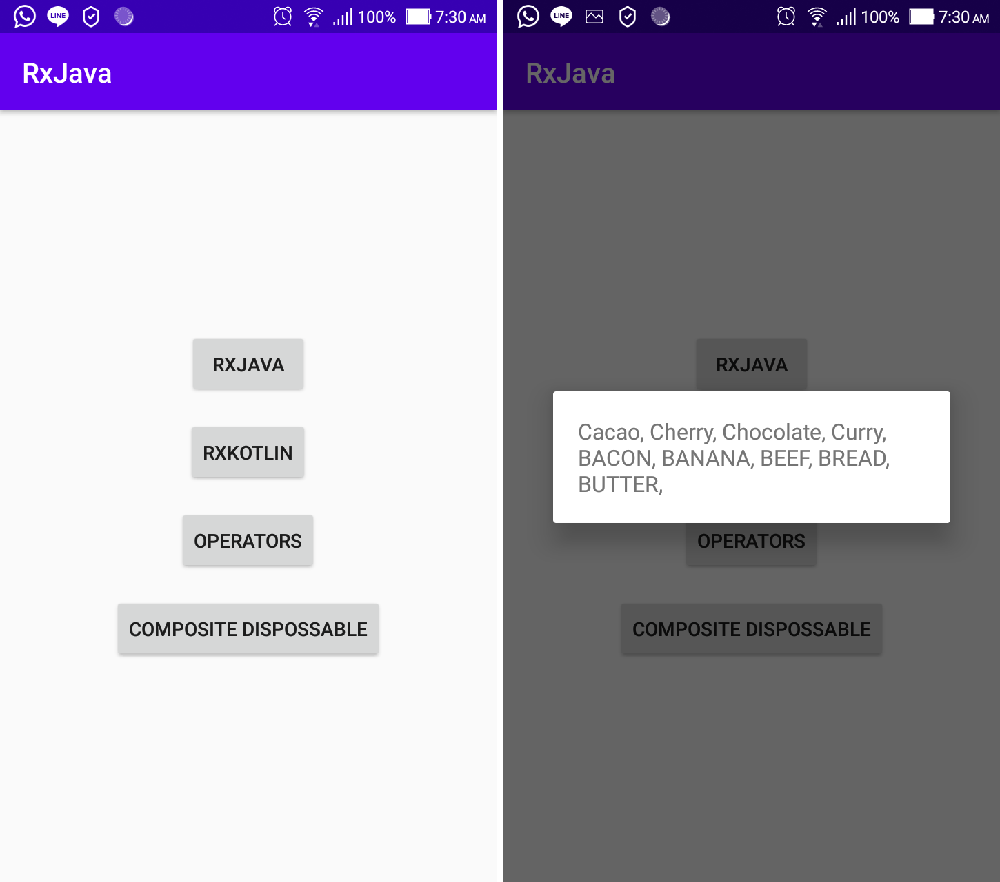

# RxJava
In this section we will learn the basics of ReactiveX in Android using Kotlin.

## Core Competency
- rxJava
- rxKotlin
- Operators
- CompositeDisposable

## Application Example

## References
- https://medium.com/@laurence.liuuu/android-reactive-programming-with-reactivex-rxjava-rxkotlin-rxandroid-3e6285858152
- https://medium.com/@laurence.liuuu/android-reactive-programming-with-reactivex-basic-examples-with-rxjava2-rxkotlin-and-rxandroid-d202ad64370d